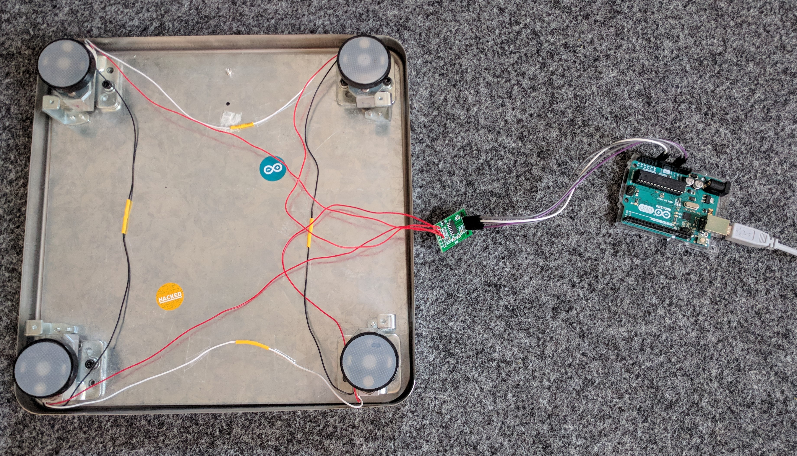
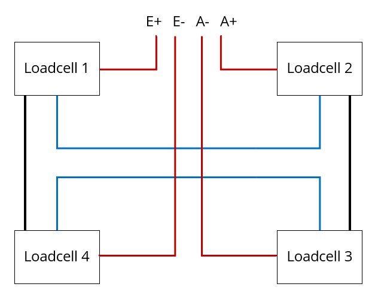
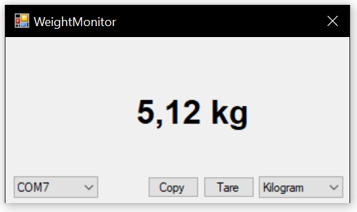

# Weigh-Scale-To-PC

Arduino code to calculate weight values from a [HX711 Load Cell Amplifier](https://cdn.sparkfun.com/datasheets/Sensors/ForceFlex/hx711_english.pdf).



## Connecting the HX711 to the Arduino

|Arduino|HX711|
|--|--|
|GND|GND|
|A1|DT (Data Out)|
|A0|SCK (Serial Clock)|
|5V|VCC|

*For the pins DT and SCK any digital or analog pin on the Arduino can be used. These are just examples from the code.*

## Wiring four three-wire load cells

If you are using four three-wire load cells, they need to be connected like this:



## Calibration

Finding the `calibration_ratio` is straightforward using `hx711_test.ino`:

```
calibration_ratio = (weight_value - offset) / weight
```

1. `Offset`: Value in the serial console, when there is no weight on the platform.
1. `Weight_value`: Value if there is a known weight on the platform

## Getting weight values in the serial console

Now adapt the `hx711_weighing` program with your `calibration_ratio` and upload it to your Arduino-compatible board. You should now see the weight in grams in the serial console.

## Windows application



The repo [Weigh-Scale-To-PC](https://github.com/MaxAtoms/Weigh-Scale-To-PC) contains a small Windows Forms application which shows the current weight on the scale. It also allows to tare and switch between units. 